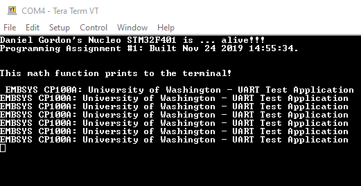

### Question 1

a) The compiler pushes 4 extra registers onto the stack to make room for x, xPtr, y, and yPtr.  
Then it uses STR to store the 4 variables on the stack.

b) R0 and R1 holds the addresses of xPtr and yPtr respectively

c) 

### Question 2

### Question 3

